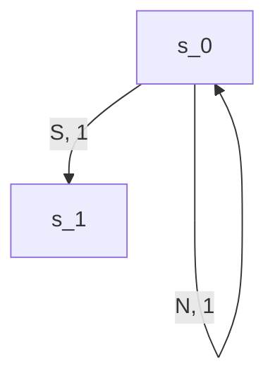
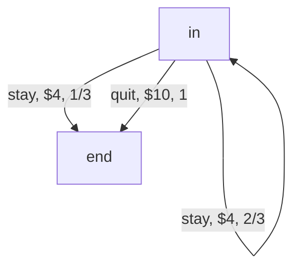

# Resumen para parciales

- [Resumen para parciales](#resumen-para-parciales)
  - [Parcial 1](#parcial-1)
    - [Qué es un agente racional?](#qué-es-un-agente-racional)
    - [PEAS](#peas)
      - [Ejemplo](#ejemplo)
    - [Ambientes](#ambientes)
      - [Observabilidad](#observabilidad)
      - [Proximo estado](#proximo-estado)
      - [Segun el tamano de los episodios](#segun-el-tamano-de-los-episodios)
      - [Paso del tiempo](#paso-del-tiempo)
      - [Espacio de acciones y espacio de percepciones](#espacio-de-acciones-y-espacio-de-percepciones)
      - [Cantidad de agentes](#cantidad-de-agentes)
      - [Segun las leyes del ambiente](#segun-las-leyes-del-ambiente)
      - [Ejemplos](#ejemplos)
    - [Tipos de Agentes](#tipos-de-agentes)
    - [Search Agents](#search-agents)
      - [Busquedas de caminos + Cortos](#busquedas-de-caminos--cortos)
    - [Ambientes estocasticos](#ambientes-estocasticos)
      - [Agente racional](#agente-racional)
        - [Algoritmos de aprendizaje de policies para MDP](#algoritmos-de-aprendizaje-de-policies-para-mdp)

## Parcial 1

### Qué es un agente racional?

- Agente
  - percibe el ambiente mediante sensores
  - actua en el ambiente mediante actuadores
- Racional
  - se espera que elija la "mejor" opcion
    - busca maximizar la performance en base a las observaciones y lo sabido

### PEAS

- Performance (metrica que nos dice que tan bien viene)
- Environment
- Actuators
- Sensors

#### Ejemplo

1) Poker (Hold' em)

   - P: fichas
   - E: mazo, cartas en la mano de cada jugador, cartas en la mesa, fichas en la mesa, fichas de cada jugador, apuestas de cada jugador
   - A: apostar, igualar, irse
   - S: apuestas recibidas, cartas en la mano,

2) Piloto automatico en un avion

   - P: Distancia al destino
   - E: el avion, el clima, el combustible, los motores, los flaps, la altitud, etc.
   - A: mover los flaps, manejar el consumo de combustible
   - S: Sensor de altitud, de velocidad, de temperatura, indicador de combustible, etc.

### Ambientes

#### Observabilidad

Puede ser:

- Completa: Podemos conocer el ambiente en su totalidad
- Parcial: Podemos conocer solo una parte del ambiente

#### Proximo estado

Puede ser:

- Determinista: Dado un estado, si efectuamos una accion, el resultado es siempre el mismo
- Estocastico: Dado un estado, si efectuamos una accion, el resultado puede cambiar

#### Segun el tamano de los episodios

Puede ser:

- Secuencial: Tenemos una secuencia de estado->accion->estado... para terminar el episodio
- Episodico: Tenemos un unico estado en el episodio

#### Paso del tiempo

Puede ser:

- Estatico: No cambia con el paso del tiempo
- Dinamico: Cambia con el paso del tiempo
Por paso del tiempo podemos tomar ejecutar una accion

#### Espacio de acciones y espacio de percepciones

Puede ser:

- Discreto: los cambios/acciones son discretos
- Continuo: los cambios son infinitesimales, el espacio de las acciones es continuo

#### Cantidad de agentes

Puede ser:

- Monoagente
- Multiagente

#### Segun las leyes del ambiente

Pueden ser:

- Conocidas
- Desconocidas

#### Ejemplos

| Ejemplo | Observavilidad | Determinista | Secuencial | Tiempo | Espacio | Cant Agentes | Leyes    |
|---------|----------------|--------------|------------|--------|---------|--------------|---------|
| Poker   | Parcial | Estocastico | Secuencial | Estatico | Discreto | Multiagente | Conocidas|
|Pacman | Total | Estocastico(?) | Secuencial | Dinamico | Discreto | Multiagente | Conocidas |
| Mario Kart | Parcial | Estocastico | Secuencial | Dinamico |  Continuo | Multiagente | Conocidas |
| Solitario | Parcial | Estocastico | Secuencial | Estatico | Discreto | Monoagente | Conocidas |
| Cubo de Rubik | Total | Determinista | Secuencial | Estatico | Discreto | Monoagente | Conocidas |
| Diagnostico Medico | Parcial | Estocastico | Episodico | Estatico | Continuo | Monoagente | Desconocidas|

### Tipos de Agentes

- Aleatorio
- Simple Reflex (si a => b)
- Model Based (nos fijamos en el modelo que hacer)
- Search Agent
- Learning Agents (por ejemplo un agente que hace policy iteration)

### Search Agents

Representamos al modelo con un multigrafos, de forma que dado un estado y una accion con un costo, nos lleva a un siguiente estado



Funciona en ambientes deterministicos y estocasticos

#### Busquedas de caminos + Cortos

- BFS
Camino mas corto en grafos no ponderados
- Dijkstra/UCS
Camino mas corto en grafos ponderados
- A*
Camino corto en grafos ponderados, busco en una direccion en particular

Que pasa cuando no conozco el grafo?

- Busqueda online
  - Greedy local search, no da buenos resultados
  - LRTA*, trata de ir en la direccion correcta, pero sin conocer el grafo

### Ambientes estocasticos

Para modelar ambientes estocasticos, usamos el modelo MDP (Markov Decision Process). Lo podemos ver como un grafo que en las aristas tiene la accion, la recompensa y la probabilidad de que la accion nos lleve por ese camino



#### Agente racional

En un MDP, el agente busca maximizar la utilidad $U$

- $U$ = suma de todas las recompenzas del episodio
Como comparamos agentes?

Buscamos el valor de una policy en un estado (en el estado inicial por ejemplo) $V_{\pi}(s)$

Para calcular $V_{\pi}(s)$ manejamos 2 opciones:

1. Resolver la recursion de forma analitica
2. Resolverlo con metodos numericos (tabulación)

Sabiendo comparar policies, como podemos mejorarla?

##### Algoritmos de aprendizaje de policies para MDP

1. Policy Improvement: Toma una policy y nos devuelve una mejor o igual
2. Policy Iteration: Repetimos policy improvement
3. Value Iteration: Partiendo de las ecuaciones de Bellman, y el concepto de policy óptima $\pi^*$. El algoritmo busca $\pi^*$

## Parcial 2

#### Value iteration

Siguiendo con los conceptos del parcial anterios, ahora buscamos calcular el valor de un estado, independiente de la policy. 

¿Cómo? Ecuacion de Bellman

$V(s) = max_{a \in A(s)}Q(s,a)$

El valor del estado es el valor obtenido siguiendo la policy optima desde ese estado, siendo la policy optima la siguiente

$\pi^*(s)=argmax_{a\in A(s)}Q(s,a)$

Teniendo este concepto, parecido a como veniamos haciendo, podemos calcular $V(s)$, y $\pi^*(s)$ de forma iterativa

$V^0(s)=0$

$Q^{t+1}(s,a)=\sum_{s'}P(s'|a,s)(R(s,a,s')+\gamma V^t(s'))$

$V^{t+1}(s,a)=max_{a\in A(s)}Q^{t+1}(s,a)$

$\pi^{t+1}(s)=argmax_{a\in A(s)}Q^{t+1}(s,a)$

#### Monte Carlo

Monte Carlo es una familia de metodos numericos para obtener soluciones a problemas a traves de pruebas aleatorias repetidas.

A nivel general, es el concepto de ajusto la respuesta, introduzco aleatoriedad, ajusto, aleatorio, y asi hasta que nos cansamos.

#### Estimacion Monte Carlo para MDPs

Consiste en generar episodios aleatorios contra el MDP que queremos conocer, y luego calcular los valores de `P` y `R`

Dado un conjunto de episodios `E`

- $P(s'|s,a)=\frac{ocurrencias\ de\ (s,a, · ,s')\ en\ E}{ocurrencias\ de\ (s,a)\ en\ E}$
- $R(s,a,s')=\frac{suma\ de\ las\ recompensas\ de\ (s,a,r,s')\ en\ E}{ocurrencias\ de\ (s,a,·,s')\ en\ E}$

#### Estimacion de valor de Policy con metodo MonteCarlo
A su vez podemos directo calcular el valor de una policy para un MDP desconocido

```
Inicializar: para todo s ∈ S
  Utilidades(s) ← {}
Repetir:
  Generar un episodio seg ́un π: s0, a0, r1, s1, ... , sT −1, aT −1, rT , sT
  G ← 0
  Para cada paso del episodio, t = T − 1, T − 2, ... , 0:
    G ← γ G + Rt+1
    Si st not in {s0, ... , st−1}: // si st es el primero del episodio
      Agregar G a Utilidades(st )
      V (st ) ← promedio(Utilidades(st ))
```

$V(s)$ converge a $V_\pi(s)$, solo para los estados visitados

Pero esto computacionalmente tiene algunos problemas, cuando tengamos suficientes datos puede pasar que el valor vaya cambiando muuuy poquito, debido a que tenemos muchas muestras, o tambien por como funcionan los numeros float, podriamos estar perdiendo informacion, entonces lo que se hace es usar diferencias temporales. Para entenderlas, primero vamos a hacer un despeje del promedio

$V^{(k)}=\frac{G^{(1)}+...+G^{(k)}+G^{(k)}}{k}$

$V^{(k+1)}=\frac{G^{(1)}+...+G^{(k)}+G^{(k+1)}}{k+1}$

$V^{(k+1)}=\frac{kV^{(k)}+G^{(k+1)}}{k+1}$

$V^{(k+1)}=\frac{kV^{(k)}}{k+1}+\frac{G^{(k+1)}}{k+1}+\frac{V^{(k)}}{k+1}-\frac{V^{(k)}}{k+1}$

$V^{(k+1)}=V^{(k)}+\frac{1}{k+1}(G^{(k+1)}-V^{(k)})$

Y cambiamos el $\frac{1}{k+1}$ por un valor $\alpha \in (0,1)$, el cual llamamos tasa de actualización. Entonces ahora podemos actualizar la estimacion del valor de V, sin depender de la cantidad de episodios que vimos, y podemos ver al $\alpha$ como "que tan rapido quiero aprender el valor de V", o como "que tanto quiero que varíe el valor de V".

Juntando esto con Monte Carlo para estimar el valor, tenemos el metodo de **Diferencias Temporales**

```
Inicializar V (s) arbitrariamente ∀s ∈ S
Repetir:
  Inicializar s
  done ← False
  Repetir hasta done:
    a ← π(s)
    s′, r , done ← step(a)
    V (s) ← V (s) + α(r + γV (s′) − V (s))
    s ← s′
```

### Q Learning (off-policy, o sea, que no depende de una policy)

Con todo esto, podemos ademas correrlo sin conocer la policy, o sea, mezclando diferencias temporales con value iteration. Para ir calculando la policy de forma online.

```
Inicializar Q(s, a) arbitrariamente ∀s ∈ S, a ∈ A(s)
Repetir:
  Inicializar s
  done ← False
  Repetir hasta done:
    Con probabilidad ε hacer: (* estrategia ε-greedy *)
      explore: a ← sample(A(s))
      exploit: a ← arg m ́ax Q(s, ·)
    s′, r , done ← step(a)
    Q(s, a) ← Q(s, a) + α(r + γ max Q(s′, ·) − Q(s, a))
    s ← s′
```

La estrategia $\epsilon$-greedy la hacemos para evitar los optimos locales, con un $\epsilon\in[0,1]$

### Juegos Alternados (de suma cero)

No siempre tenemos un agente interactuando en un ambiente, hay veces que tenemos algun juego por turnos entre varios jugadores. Como puede ser el ta-te-ti, las damas, el ajedrez, etc.

Para resolver estos problemas vamos a usar o la tecnica minimax, o la tecnica expectimax.

La diferencia entre estas tecnicas, es que expectimax, calcula el movimiento del rival de forma estocastica (en base a una probabilidad), mientras que minimax asume que el rival va a ejecutar la accion que sea peor para nosotros (en esto influye que el juego sea suma 0, asumimos que si es peor para nosotros, es mejor para el rival).

Para calcular la utilidad de expectimax, tenemos que saber si estamos en el paso "expecti" (el rival), o "max" (el agente), o en un estado final.

- Si estamos en un estado final, la utilidad la conocemos y devolvemos esa utilidad.
- Si estamos en un paso "max", la utilidad del estado es la maxima utilidad de los estados siguientes
- Si estamos en un paso "expecti", la utilidad del estado es la suma ponderada (de acuerdo a la distribucion de probabilidad) de las utilidades de los siguientes estados

Para calcular la utilidad de minimax, es casi igual, pero ahora en vez de "expecti", tenemos "mini" para el rival

- Si estamos en un estado final, la utilidad la conocemos y devolvemos esa utilidad.
- Si estamos en un paso "max", la utilidad del estado es la maxima utilidad de los estados siguientes
- Si estamos en un paso "mini", la utilidad del estado es la minima utilidad de los estados siguientes

#### Propiedades de minimax

$\pi_{minimax}$ es la estrategia optima frente a un rival que juega con $\pi_{min}$

El valor de $\pi_{minimax}$ es una cota inferior ante cualquier $\pi$ que utilice el rival

### Limitantes

Son operaciones costosisimas, en general crecen de forma exponencial, sino peor, tanto en tiempo como en espacio

¿Cómo solucionamos?

Haciendo una poda. Limitamos la profundidas, y cuando llegamos al limite, utilizamos una funcion de evaluacion heuristica. Muy del estilo a la usada en A*

¿Es la unica opcion?

En caso de que estemos utilizando minimax, podemos ademas usar $\alpha\beta$-pruning para lograr una mayor profundidad, sin tener que calcular caminos que no sirven (Lectura opcinal del libro)
