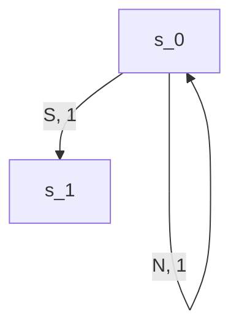

# Repaso

## Que es un agente racional
- Agente
	- percibe el ambiente mediante sensores
	- actua en el ambiente mediante actuadores
- Racional
	- se espera que elija la "mejor" opcion
		- busca maximizar la performance en base a las observaciones y lo sabido

## PEAS
- Performance (metrica que nos dice que tan bien viene)
- Environment
- Actuators
- Sensors

### Ejemplo
1) Poker (Hold' em)
	- P: fichas
	- E: mazo, cartas en la mano de cada jugador, cartas en la mesa, fichas en la mesa, fichas de cada jugador, apuestas de cada jugador
	- A: apostar, igualar, irse
	- S: apuestas recibidas, cartas en la mano, 
2) Piloto automatico en un avion
	- P: Distancia al destino
	- E: el avion, el clima, el combustible, los motores, los flaps, la altitud, etc.
	- A: mover los flaps, manejar el consumo de combustible
	- S: Sensor de altitud, de velocidad, de temperatura, indicador de combustible, etc.

## Ambientes
### Observabilidad
Puede ser:
- Completa: Podemos conocer el ambiente en su totalidad
- Parcial: Podemos conocer solo una parte del ambiente
### Proximo estado
Puede ser:
- Determinista: Dado un estado, si efectuamos una accion, el resultado es siempre el mismo
- Estocastico: Dado un estado, si efectuamos una accion, el resultado puede cambiar
### Segun el tamano de los episodios
Puede ser:
- Secuencial: Tenemos una secuencia de estado->accion->estado... para terminar el episodio
- Episodico: Tenemos un unico estado en el episodio
### Paso del tiempo
Puede ser:
- Estatico: No cambia con el paso del tiempo
- Dinamico: Cambia con el paso del tiempo
Por paso del tiempo podemos tomar ejecutar una accion
### Espacio de acciones y espacio de percepciones
Puede ser:
- Discreto: los cambios/acciones son discretos
- Continuo: los cambios son infinitesimales, el espacio de las acciones es continuo
### Cantidad de agentes
Puede ser:
- Monoagente
- Multiagente
### Segun las leyes del ambiente
Pueden ser:
- Conocidas
- Desconocidas
### Ejemplos
| Ejemplo | Observavilidad | Determinista | Secuencial | Tiempo | Espacio | Cant Agentes | Leyes    |
|---------|----------------|--------------|------------|--------|---------|--------------|---------|
| Poker   | Parcial | Estocastico | Secuencial | Estatico | Discreto | Multiagente | Conocidas|
|Pacman | Total | Estocastico(?) | Secuencial | Dinamico | Discreto | Multiagente | Conocidas |
| Mario Kart | Parcial | Estocastico | Secuencial | Dinamico |  Continuo | Multiagente | Conocidas | 
| Solitario | Parcial | Estocastico | Secuencial | Estatico | Discreto | Monoagente | Conocidas |
| Cubo de Rubik | Total | Determinista | Secuencial | Estatico | Discreto | Monoagente | Conocidas |
| Diagnostico Medico | Parcial | Estocastico | Episodico | Estatico | Continuo | Monoagente | Desconocidas|

## Tipos de Agentes
- Aleatorio
- Simple Reflex (si a => b)
- Model Based (nos fijamos en el modelo que hacer)
- Search Agent
- Learning Agents (por ejemplo un agente que hace policy iteration)

## Search Agents
Representamos al modelo con un multigrafos, de forma que dado un estado y una accion con un costo, nos lleva a un siguiente estado

Funciona en ambientes deterministicos y estocasticos

### Busquedas de caminos + Cortos

- BFS
Camino mas corto en grafos no ponderados
-  Dijkstra/UCS
Camino mas corto en grafos ponderados
-  A*
Camino corto en grafos ponderados, busco en una direccion en particular

Que pasa cuando no conozco el grafo?
- Busqueda online
	- Greedy local search, no da buenos resultados
	- LRTA*, trata de ir en la direccion correcta, pero sin conocer el grafo

## Ambientes estocasticos
Para modelar ambientes estocasticos, usamos el modelo MDP (Markov Decision Process). Lo podemos ver como un grafo que en las aristas tiene la accion, la recompensa y la probabilidad de que la accion nos lleve por ese camino
```mermaid
graph TD;
	in --> |stay, $4, 2/3| in;
	in --> |stay, $4, 1/3| end;
	in --> |quit, $10, 1| end;
```


### Agente racional
En un MDP, el agente busca maximizar la utilidad U
	- Utilidad = suma de todas las recompenzas del episodio
Como comparamos agentes?

Buscamos el valor de una policy en un estado (en el estado inicial por ejemplo) `V_pol(s)`

Sabiendo comparar policies, como podemos mejorarla?

`Policy Improvement`, y si repetimos esto muchas veces, estamos haciendo `Policy Iteration`
